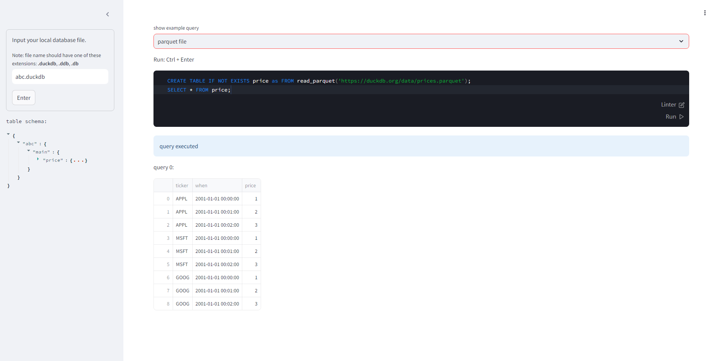

# Meager SQL Editor / 貧者の SQL エディター

## Caution / 注意

- This is a toy and study project. Not for business use.  
  これは学習目的のプロジェクトです。ビジネス用途には使用しないでください。

## Purpose / 目的

- A SQL editor using DuckDB as the backend, aimed at being a simple alternative to Redash.  
- It is a single file application using Python & Streamlit, executed with PEP 723 (`uv` or `pipx`).  
- It can be executed with only the installation of `uv`.  

- RedashのSQL Editor部分を模し DuckDB をバックエンドとした SQL エディターです。
- Python & Streamlit のシングルファイルとして、PEP 723 で実行します (`uv` または `pipx`)。
- `uv` のインストールのみで実行可能です。

## Prerequisit

- install `uv`:

use brew (for Mac or WSL2)

```sh
brew install uv
```

or

<details><summary> See the installation documentation</summary><div>

[installation documentation](https://docs.astral.sh/uv/getting-started/installation/)

```sh
# On macOS and Linux.
$ curl -LsSf https://astral.sh/uv/install.sh | sh

# On Windows.
$ powershell -ExecutionPolicy ByPass -c "irm https://astral.sh/uv/install.ps1 | iex"
```

</div></details>

## Execution / 実行方法

Save locally and run:
ローカルに保存して実行します：

```sh
curl -o mse.py https://raw.githubusercontent.com/koizumihiroo/meager-sql-editor/refs/heads/master/mse.py
uv run mse.py
```

## Functionality / 機能

- **Sidebar / サイドバー**  
  - Specify the DuckDB persistence file  
  - Display the table schema  
  
- **Main screen / メイン画面**  
  - Selection and display of sample queries  
  - SQL editor  
    - Linter  
    - Run  
  - Display of results  
    - Display using `st.dataframe` from Streamlit (download CSV, etc.)  

- **サイドバー**
  - DuckDB の永続化ファイルの指定
  - テーブルスキーマの表示
- **メイン画面**
  - サンプルクエリの選択と表示
  - SQL Editor
    - リンター機能
    - クエリの実行
  - 結果の表示
    - 結果は Streamlit の `st.dataframe` で表示され、CSVダウンロードなどが可能


